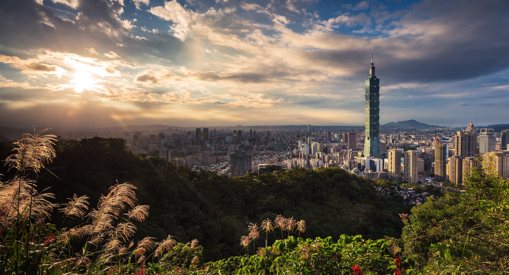

# MkDocs GLightbox 

A MkDocs plugin supports image lightbox with [GLightbox](https://github.com/biati-digital/glightbox).

GLightbox is a pure javascript lightbox library with mobile support.

## Dependency

1. Python Package
    1. beautifulsoup4>=4.11.1
2. GLightbox javascript file and css file
    1. GLightbox==3.2.0

## Usage

1. Install plugin from pypi

    ```bash
    pip install mkdocs-glightbox
    ```

2. Add ```glightbox``` plugin to your mkdocs.yml plugins sections:

    ```yaml
    plugins:
       - glightbox
    ```

3. You may customize the plugin by passing options in mkdocs.yml:

    ```yaml
    plugins:
       - glightbox:
           touchNavigation: true
           loop: false
           effect: zoom
           slide_effect: slide
           width: 100%
           height: auto
           zoomable: true
           draggable: true
           skip_classes:
             - custom-skip-class-name
           auto_caption: false
           caption_position: bottom
    ```

    | Option           | Default | Description                                                                                          |
    |------------------|---------|------------------------------------------------------------------------------------------------------|
    | touchNavigation  | true    | Enable or disable the touch navigation (swipe).                                                      |
    | loop             | false   | Loop slides on end.                                                                                  |
    | effect           | zoom    | Name of the effect on lightbox open. (zoom, fade, none)                                              |
    | slide_effect     | slide   | Name of the effect on lightbox slide. (slide, zoom, fade, none)                                      |
    | width            | 100%    | Width for inline elements and iframes. You can use any unit for example 90% or 100vw for full width. |
    | height           | auto    | Height for inline elements and iframes. You can use any unit for example 90%, 100vh or auto.         |
    | zoomable         | true    | Enable or disable zoomable images.                                                                   |
    | draggable        | true    | Enable or disable mouse drag to go prev and next slide.                                              |
    | skip_classes     | [ ]     | Disable lightbox of those image with specific custom class name.                                     |
    | auto_caption     | false   | Enable or disable using alt of image as caption title automatically.                                 |
    | caption_position | bottom  | Default captions position. (bottom, top, left, right)                                                |

    Check more options information on [GLightbox Docs](https://github.com/biati-digital/glightbox#lightbox-options).

4. For more flexibility, you can disable lightbox by a [specific image](./disable/image.md) or a [specific page](./disable/page.md).
5. Support lightbox image caption, check more details on [Caption](./caption/caption.md)

## Demo

Click the image to try lightbox and enjoy the view of Taiwan.

<figure markdown>

 

<figcaption markdown>Sunset over Taipei City. Credit: [Thomas Tucker](https://unsplash.com/photos/au3CYbd7vCU)</figcaption>
</figure>

<figure markdown>

 

<figcaption markdown>Lanyu, Taiwan. Credit: [Robson Hatsukami Morgan](https://unsplash.com/photos/T8LZZvKc9Jc)</figcaption>
</figure>

<figure markdown>

 

<figcaption markdown>Kenting, Taiwan. Credit: [Yuhan Chang](https://unsplash.com/photos/ROWXoqmqyjk)</figcaption>
</figure>


## License

This project is licensed under the MIT License - see the [LICENSE.md](https://github.com/Blueswen/mkdocs-glightbox/blob/main/LICENSE) file for details.
